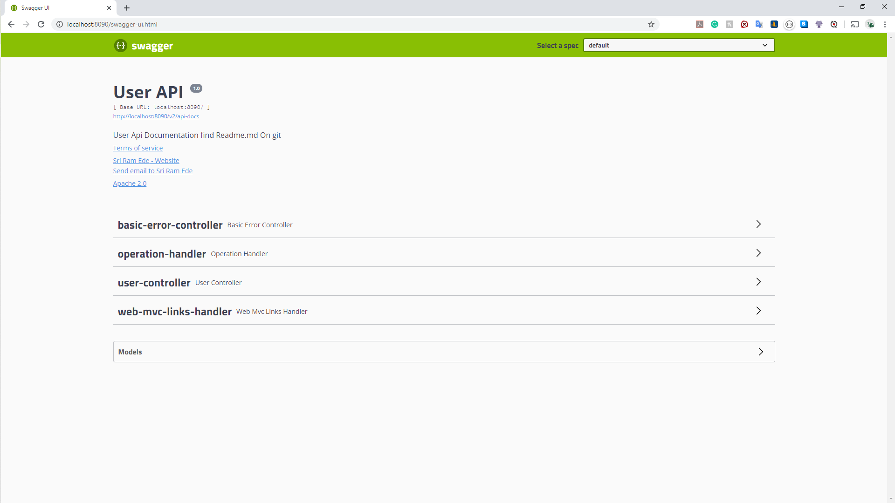

# USER - RESTfull API

### HTTP - Methods with User Sample Data

### User Module -> id,name,dob

### validating name [size min 3 and dob of past value] and Exception Handling using  ResponseEntityExceptionHandling

### HATEOAS --> when requested by id will give links-> "all-Users"

### Jackson-data-format-xml for accepting JSON,XML using Accept header 

### Added Swagger API, SwaggerUI,https://springfox.github.io/springfox/docs/current/

### Used ORM Tech to embedd with MySql Database

### Important addings

#### ServletUriComponentsBuilder,ResponseEntity

#### ResponseEntityExceptionHandler @ControllerAdvice

#### Validation @Valid @Size @NoTBlank REEH methoOverride

#### HATEOAS RESOURCE,CONTROLLERLINKBUILDER,LINK	

#### XML<=> JSON with maven dependence and request header with Accept=application/xml,application/json,@XMLRootElement

#### @EnableSwagger2 ,Docket,@ApiModel,@ApiModelParam

####  @Entity,@Id,@Generated

#### Libraries

* WEB
* Actuator
* Devtools
* HATEOAS
* jackson-dataformat-xml
* Swagger from Springfox
* Spring-boot-starter-data-jpa
* mysql-connector-jpa

## Images

